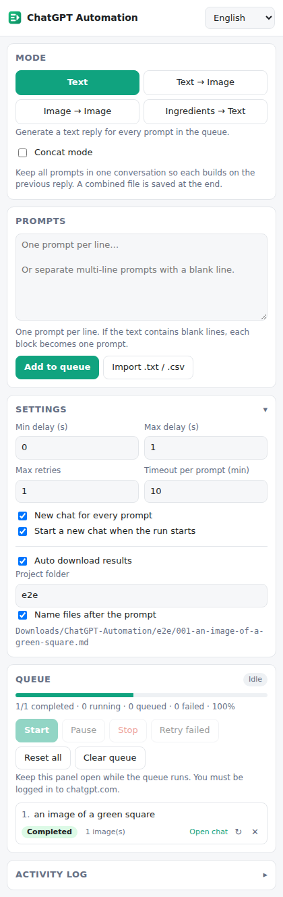

# ChatGPT Automation (bash-auto)

**Auto ChatGPT for your prompts at scale.** Batch generate and auto-download responses and images on [chatgpt.com](https://chatgpt.com).

ChatGPT Automation is a Chrome extension (Manifest V3) that turns ChatGPT into a batch-processing engine. Queue dozens or hundreds of prompts in the Side Panel and it will submit each one, wait for the reply to finish, save the result, and move on to the next prompt. No clicks, no babysitting.

<p align="center"></p>

## Features

### 🤖 Batch processing
- Queue prompts by typing them (one per line, or blocks separated by a blank line) or importing a `.txt` / `.csv` file (uses the `prompt` column, or the first column if there isn't one)
- Submits each prompt, waits for generation to finish, then moves on
- Live queue with per-prompt status (**Queued → Running → Completed / Failed**), a retry counter, a progress bar, and a link back to each conversation
- Start / Pause (finishes the current prompt first) / Stop / Retry failed / Reset / Clear
- The queue is saved, so you can close the panel and resume later

### ✍️ Text mode
- One text reply per prompt, saved as a Markdown file (prompt + response)
- **Concat mode** keeps every prompt in one conversation so each builds on the previous reply, and saves a combined `concat-combined.md` at the end

### 🖼️ Text → Image
- Generate images from text descriptions; every generated image is downloaded
- Aspect ratios: **16:9**, **9:16**, **1:1** (or leave it unspecified)

### 🎨 Image → Image
- Upload source images, and each prompt is sent with an image to transform or enhance it. If you upload as many images as there are prompts, each prompt gets its own image; otherwise every image is sent with every prompt.
- **Chain mode** uses the image generated by the previous prompt as the input for the next one

### 🧩 Ingredients → Text
- Upload reference images and batch-process them with prompts
- **Auto-add by filename**: `alice.png` is attached only to prompts that mention "Alice". `bob_smith.jpg` matches "bob smith". Turn it off to attach every image to every prompt.

### ⚙️ Automation controls
- **Smart random delay** between prompts (configurable min/max seconds) to avoid rate limits
- **Max retries** for prompts that fail (errors, rate-limit banners, timeouts, no image generated)
- Timeout per prompt
- New chat for every prompt, or start a new chat only when the run starts

### 📂 Auto download and file organization
- Results are saved to `Downloads/ChatGPT-Automation/<project>/`
- Files are auto-renamed from the prompt: `001-a-cozy-cabin-in-the-snow.png`, `002-…md`. Multiple images from one prompt get `-2`, `-3`, … suffixes
- File names keep non-Latin letters (Vietnamese, Chinese, Japanese, Korean…)

### 🌐 Languages
English · Tiếng Việt · 中文 · 한국어 · 日本語 · Español. The panel starts in your browser's language, and you can switch at any time from the top-right menu.

## Install (unpacked)

1. Download or clone this repository.
2. Open `chrome://extensions` and turn on **Developer mode**.
3. Click **Load unpacked** and select the repository folder (the one containing `manifest.json`).
4. Pin the extension and click its icon to open the Side Panel.

Works in Chrome 116+ and other Chromium browsers that support the Side Panel API (Edge, Brave, …).

## Usage

1. Log in to [chatgpt.com](https://chatgpt.com) in a tab. If no ChatGPT tab is open, the extension opens one.
2. Open the Side Panel, pick a **mode**, and set its options (aspect ratio, chain, reference images…).
3. Paste your prompts and click **Add to queue**, or import a file.
4. Optionally adjust **Settings** (delays, retries, project folder, file naming).
5. Click **Start**. Keep the panel open while the queue runs, and keep the ChatGPT tab as the active tab in its window. Chrome throttles background tabs, which slows down or stalls generation.

> Tip: Chrome may ask for permission to download multiple files the first time. Allow it for the extension.

## Project structure

```
manifest.json          MV3 manifest (side panel, downloads, storage, scripting)
background.js          Opens the side panel from the toolbar icon
content/
  selectors.js         Every chatgpt.com DOM selector, all in one place
  driver.js            Types the prompt, attaches files, sends, waits, extracts text/images
sidepanel/
  index.html, panel.css
  app.js               UI, settings, queue editing, persistence
  runner.js            Queue engine: tabs, retries, delays, downloads
  modes.js             Per-mode request building (aspect ratio, chain, ingredients)
  i18n.js              Runtime language switching
lib/utils.js           Pure helpers (prompt parsing, delays, slugs, file names, matching)
_locales/<lang>/       Translations (en, vi, zh_CN, ko, ja, es)
icons/                 Extension icons
tests/                 Unit tests, static checks, Playwright end-to-end test + mock ChatGPT page
```

### When ChatGPT changes its UI
ChatGPT's page structure changes from time to time. All selectors live in [`content/selectors.js`](content/selectors.js) (composer, send/stop buttons, message turns, generated images, error banners), and error phrases that trigger a retry are in `CGA_ERROR_PATTERNS` in the same file. Updating that file is usually all it takes.

## Development

No build step: the extension loads straight from source.

```bash
npm test            # unit tests (node:test) for helpers and mode logic
npm run check       # manifest/locale validation, missing translation keys
npm run test:e2e    # Playwright: driver vs. a mock ChatGPT page, and the real extension
                    # running a queue against chatgpt.com routed to that mock page
```

`test:e2e` needs Playwright with Chromium (`npm i -D playwright && npx playwright install chromium`), or set `CHROMIUM_PATH` to an existing Chromium binary.

To add a language, copy `_locales/en/messages.json` to `_locales/<code>/`, translate it, and add the code to `LANGUAGES` in `sidepanel/i18n.js`. `npm run check` reports any missing keys.

## Disclaimer

This project is not affiliated with or endorsed by OpenAI. Automating chatgpt.com may be subject to OpenAI's Terms of Use and usage limits. Use reasonable delays and respect your plan's limits.
